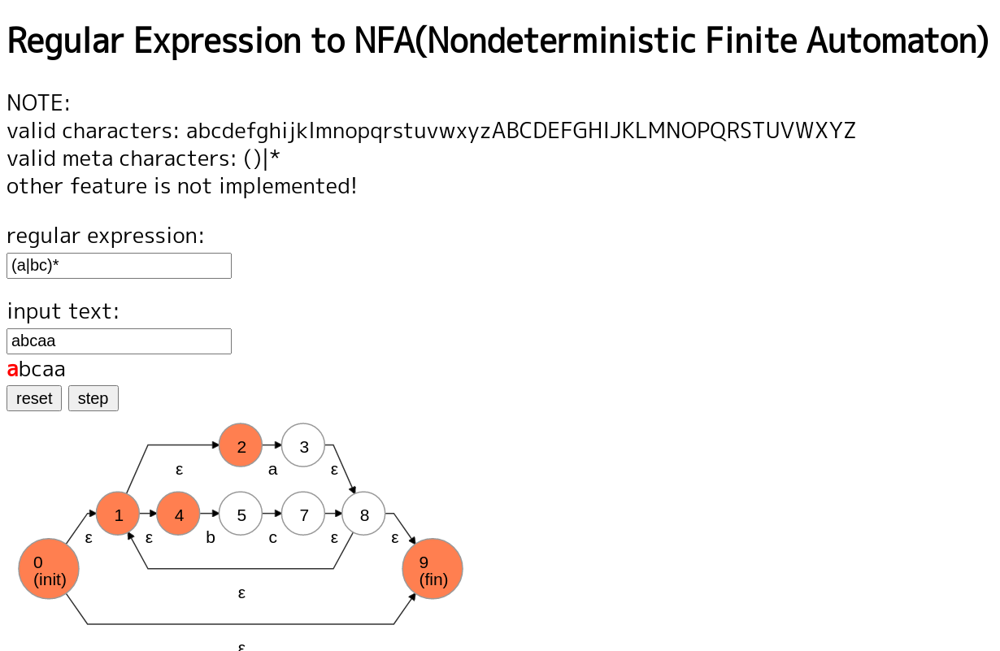

# simple_regular_expression_engine_for_learning
Simple regular expression engine implementation based on NFA(Nondeterministic Finite Automaton).

## NOTE

This repository is created for only learning use. So, feature of this regular expression engine is very poor.

* valid characters: `abcdefghijklmnopqrstuvwxyzABCDEFGHIJKLMNOPQRSTUVWXYZ`
* valid meta characters: `()|*`
* other feature is not implemented!

## Demo

Demo to understand conversion from regular expression to NFA.

Demo URL: https://simple-regex-to-nfa-example-1212.netlify.app/

NOTE:
[dagrejs/dagre-d3](https://github.com/dagrejs/dagre-d3) is used to generate the graph in the image.

## Author

hrhr49

hiro49410@gmail.com

## License
MIT
